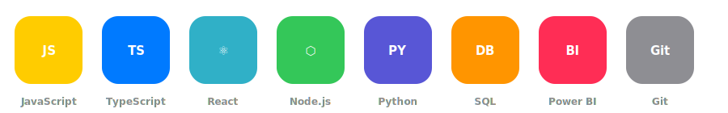

  

  

  

### 👋 About

*Frontend developer and data analyst.*

Focused on building modern web interfaces and turning raw data into clear, useful insights.

- 🔭  Working on personal projects and continuous learning
- 🌱  Exploring new tools across the frontend and data ecosystems
- 💬  Ask me about JavaScript, TypeScript, React, Python, SQL or Power BI
- ✉️  germangraphs@gmail.com

### 🧩 Stack

*Tools I use most.*

  

### 📊 GitHub Stats

*A live snapshot of my activity.*

  
  

  

  <picture>
    <source media="(prefers-color-scheme: dark)" srcset="https://raw.githubusercontent.com/GermanAndresLopez/GermanAndresLopez/output/github-contribution-grid-snake-dark.svg" />
    
  </picture>

### 🚀 Featured Projects

*A few things I've built.*

| | |
|---|---|
| **[Portfolio](https://github.com/GermanAndresLopez/Portfolio)** › | My personal portfolio, updated 2025, built with TypeScript |
| **[GlTV Mobile App](https://github.com/GermanAndresLopez/GlTV-Mobile-App)** › | Mobile app built with Dart/Flutter |
| **[GlTV Web Version](https://github.com/GermanAndresLopez/GlTV--web-version)** › | Web version of GlTV, built with JavaScript |
| **[Dashboard E-R](https://github.com/GermanAndresLopez/Dashboard--E-R)** › | Dashboard visualizing wind and renewable energy statistics — Power BI, Supabase, Vite |
| **[Dashboard Temperaturas](https://github.com/GermanAndresLopez/Dashboard-Temperaturas)** › | Dashboard built with Power BI, a cloud database (Supabase), and a Vite frontend |
| **[NeuroExplora](https://github.com/GermanAndresLopez/NeuroExplora)** › | Web project built with HTML |
| **[SistemaPQR](https://github.com/GermanAndresLopez/SistemaPQR)** › | Requests, complaints and claims (PQR) system, built with JavaScript |

### ✉️ Contact

  
  

